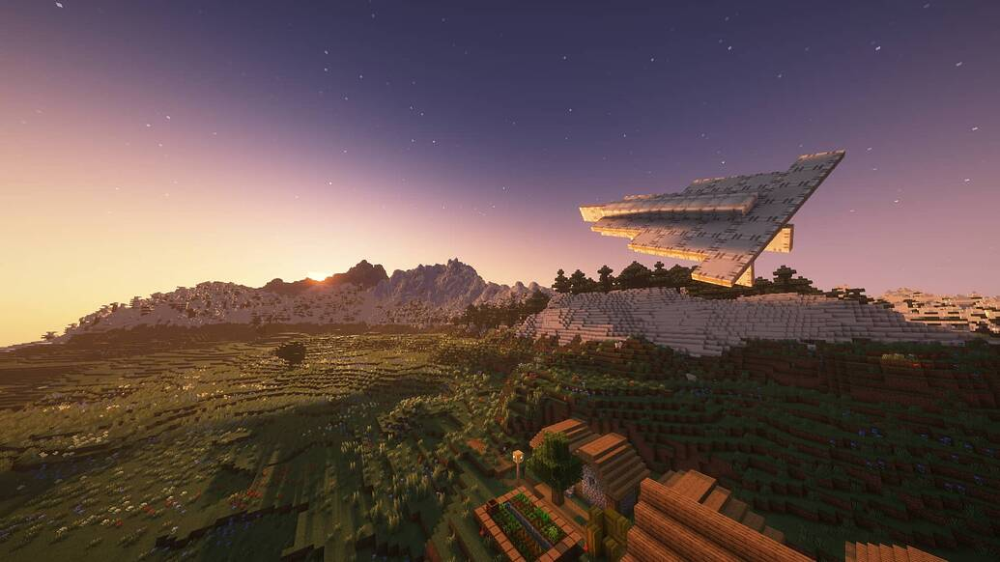
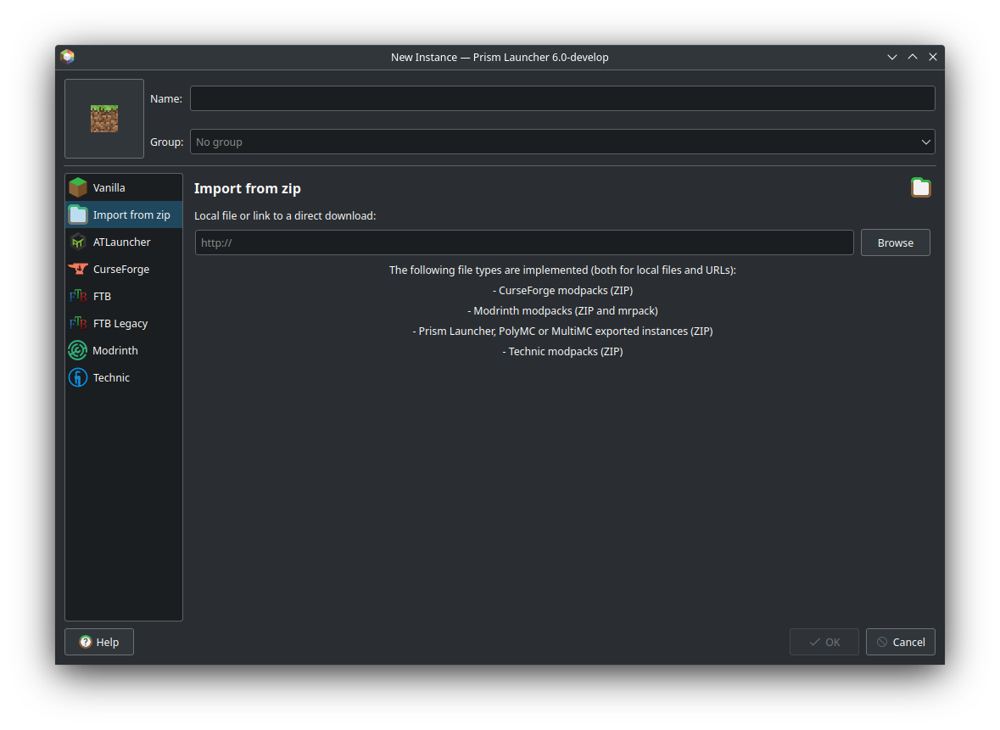
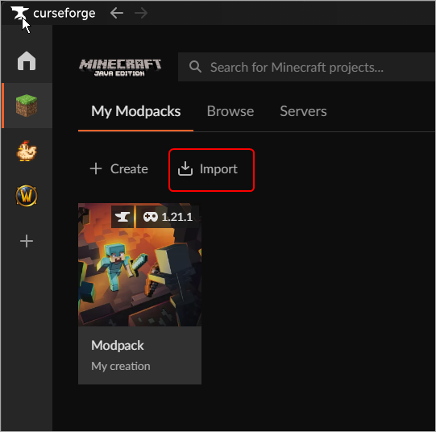
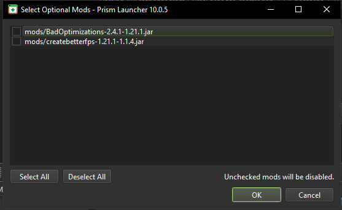

# Flying Gardeners Modpack

## How to download
1. Go to this page's (Release) files
2. 2. Download the `Flying_Gardeners.zip` file,
3. Open your launcher of choice and import the pack there

**For Prism Launcher**

**For CurseForge** 

4. Wait for the launcher to import all the mods. 
> NOTE: There is a chance that this popup might appear when downloading the mods
> 
> These are optimization mods. You can add them or ignore them, its up to you. The pack has them disabled by default
> After You choose to add them or not, Click OK
5. The Pack has been sucessfully installed :D 

#### A note about shaders

> Shaders are not included in the back, they are up to the user and to their liking. 
> Shader packs are included, but also disabled by default and up to the player's liking. 

**For CurseForge** 

4. Wait for the launcher to import all the mods. 
> NOTE: There is a chance that this popup might appear when downloading the mods
> 
